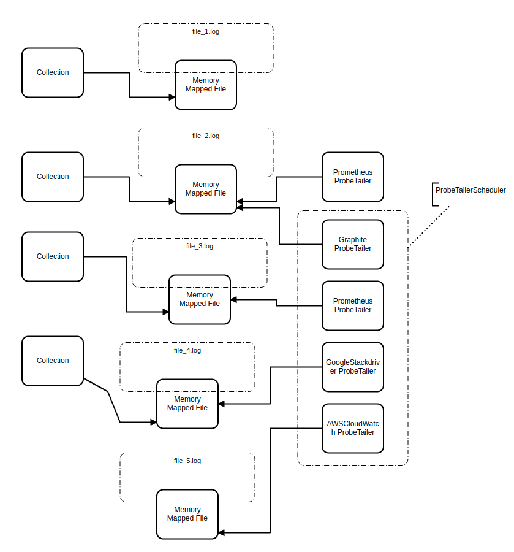
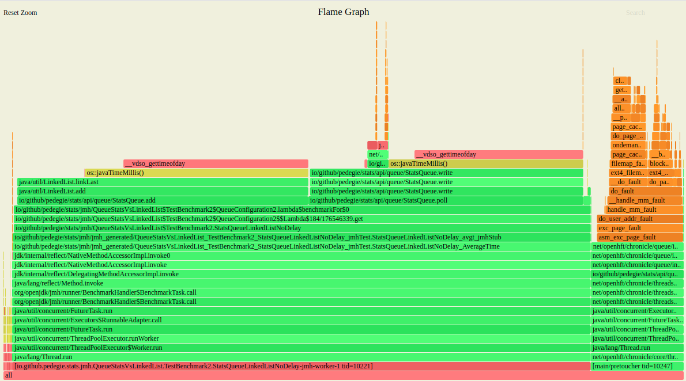

# Stats

**Stats** is Java tracing collection library. Stats allow monitoring yours `Collection`,`Map` and Thread Pools with zero-cost overhead.

**ITS STILL UNDER DEVELOPMENT - DON'T USE ON PRODUCTION**

## Table of contents

- [Overview](#overview)
- [Motivation](#motivation)
- [Architecture](#architecture)
    - [Zero-cost](#zero-cost)
- [Implementation Details](#implementation-details)
- [Code and Features](#code-and-features)
    - [Writer](#writer)
    - [ProbeTailer](#probetailer)
    - [ProbeTailerScheduler](#probetailerscheduler)
    - [Closing Stats](#closing-stats)
    - [Supported Collection Interfaces](#supported-collection-interfaces)
- [Monitoring Thread Pool](#monitoring-thread-pool)
- [Crash handling](#crash-handling)
- [Benchmarks](#benchmarks)
- [Supported Monitoring Tools](#supported-monitoring-tools)
    - [Prometheus](#prometheus)
    - [Incoming integrations](#incoming-integrations)
    - [Add your own integration](#add-your-own-integration)


## Overview
**Stats** is lightweight `Map` and `Collection` decorator which saves to file
current `size` of `Map/Collection` on every each access if it changes its size - on reading side library can push data to
monitoring tools like [Graphite](https://graphiteapp.org/), [ElasticSearch](https://www.elastic.co/) or makes data
available to [Prometheus](https://prometheus.io/) and other pull-based inspection tools.

Library is build on top of [Chronicle-Queue](https://github.com/OpenHFT/Chronicle-Queue) giving us huge advantage
of super low latency and persistence if crash occurs or if we want to postpone publishing collected statistics.

## Motivation
The problem I have to deal with almost all my projects was: "How to monitor **efficiently** thread pools, without
*observer-effect*?". I believe thread pools are the most important parts in correctly designed system, when it comes
to monitoring, collecting statistics, scaling, debugging and bottleneck recognition.

When you design your system there are (or at least should be) separate thread pools for different responsibilities:
thread pool which connects to database, services which ask network for data also usually need a thread pool,
for example most of HTTP client libraries use thread pools, some CPU-bound workload delegated to separate pool or just
simple Akka actor consuming messages from queue which is served by Dispatcher. We can say that our system is divided
into multiple parts separated by thread pools. What if we could get notification each time when pool is saturated? It's
easy to point then **this** part of system is overload additionally with real-time monitoring we can just prevent
overloading system by taking some actions **before** system becomes unresponsive or in the worst case crash.

Another situation is: system failure - client says that something is going wrong, lets say users cannot log in to site,
and we don't see any errors or other team within our company complains that sometimes they get disconnects from our service
with no reason - these problems are really hard to diagnose when it just slowdowns without any explicit reason.  
Typically, in kind of these problems we dive into investigating our machine - checking RAM, CPU, network,
file descriptors, thread dumps, it may be necessary to run some tracing / profiling tools too - which is not always
the case especially in production systems. If we think about it a little more - we do it all in one reason: link
hardware problems to source code, then we can determine what the problem is and
propose solution. For example our outbound network interface is overloaded, by continuously sending huge packages what
shouldn't happen, we can use tools like `bpftrace` to capture packages with corresponding size, find port and
process related to it, then try to resolve a stacktrace in hope we get into right place in source code, or
high CPU usage because of our GC is taking all CPU time performing full GCs, memory dump confirms there is a lot of
`byte[]` arrays with given size, we can then look for these sizes in our app, but it's usually not that simple and
in the best case time-consuming. The real problem is that on hardware / OS level we don't know anything
about application logic - so we spend most time for linking one to the other. In both cases there is a big chance
we can find problem just looking for saturated thread pools, in first case it would be some pool of network client
which continuously sends requests, for further case maybe a lot of messages waits on our `Queue` because consumer isn't
fast enough.

I need variance not just average - information that there is on average 100 000 elements in queue per hour is
not enough, we can omit peaks, what if there was peak 95 000 elements in first minute of hour? Without this information
we cannot really find the problem in case of system slowdown / failure when peaks are overlooked. **Stats** records
every single element, or at least enough to determine this situation. It's why, one of main goals of **Stats** is
to be really fast, last thing we would like to do is putting pressure on already overloaded system - on the other hand,
tracing overloaded system gives us the most important information. **Stats** is doing it with zero-cost.

So basically, why it's `Map/Collection` decorator instead of some "Thread Pool Stats"? Well, it's because of how Java thread
pools works. When there isn't enough threads to do the job and max limit of threads in pool has been reached items
go onto queue, we can say that thread pool is saturated when it contains at least single element on its queue - it's why monitoring
of queue is the key. So if I'm going to create a queue monitoring library why not to extend this to `Map/Collection`
interface?

**Stats** is designed to do one job but really well and with this thought it was developed. All source code changes
which makes **Stats** slower will be rejected - also all merge requests which proves with benchmarks that makes
it faster without breaking functionality and extensibility - accepted.

## Architecture
**Stats** can be divided into two parts - write side which decorates `Map/Collection` is responsible for writing to file and
read side which reads probes from file and publish data to monitoring tools. **Stats** is build on top of
[Chronicle-Queue](https://github.com/OpenHFT/Chronicle-Queue) what means both sides access *Memory Mapped File* instead of
interacting with physical storage what makes it pretty fast. On reading side there is `ProbeTailerScheduler` which schedules
`ProbeTailers` reading probes.



1. Writers and `ProbeTailers` are independent of each other. **They can be separate processes**.
2. There may be at most one writer for each file.
3. There may be multiple `ProbeTailers` for single file - if you want to publish statistics to multiple sources.
4. `ProbeTailers` can work within scheduler or outside, advantage of using scheduler is that one thread can handle multiple tailers.
5. If you run both sides at the same time, there is no physical storage access overhead, thanks to memory mapped files.
6. You can write probes to file and collect / analyze them later maybe using dedicated library.

Writing probes is [producer centric](https://github.com/OpenHFT/Chronicle-Queue#what-is-a-producer-centric-system)
what means that "fast producer, slow consumer" problem doesn't exist at all. Reading and writing can be done from
different processes - again thanks to [Chronicle-Queue](https://github.com/OpenHFT/Chronicle-Queue).

One of main **Stats** goals is to allow easy expandability:
- adding new integration with monitoring systems should be easy as possible - [add new integration](#add-your-own-integration)
- changes to most important parts of core **Stats** mechanisms should be done easily by just providing custom implementation -
  you can just plug-in your own `Probe` serializer / deserializer, compression mechanism, `Probe` filter, exception handler
  any many more - [features](#code-and-features)

### Zero-cost
What basically means zero-cost? Well in short it's - "if writing probe is going to have any impact - don't do it".
Does it mean probe is lost then? No, lets explain how actually writing works.

##### Concurrent Collections:
When you add or removes something from `Map/Collection` its `size` is kept in [LongAdder](https://docs.oracle.com/en/java/javase/11/docs/api/java.base/java/util/concurrent/atomic/LongAdder.html).
Next, the writing thread have to win Compare and Swap instruction to exclusively access [Bytes](https://www.javadoc.io/doc/net.openhft/chronicle-bytes/1.12.17/net/openhft/chronicle/bytes/Bytes.html)
where it puts current timestamp and `size` computed with `LongAdder.intValue()`. Bytes contain batched data,
later flushed (see [Batching](#batching)) by [Flusher](#flusher). In case of  contention, thread just lose CAS but this change is still
registered in `LongAdder` and is taken into account on next write. Mechanism is `lock-wait free` we say.

##### Non-Concurrent Collections:
We can configure **Stats** to completely disable synchronization logic - its useful when our environment is not
multithreaded or there is a guarantee that at most one thread at given time access `Map/Collection` - for example
Akka's Actor could have some `Map` or `List` and as we know Actors are thread safe by design. In this scenario we
should set parameter `disableSynchronization` to true during creating `StatsQueue`.

Writing to non-concurrent collections is pretty same as with concurrent but instead of `LongAdder` there is simple `long`,
also CAS instruction is removed what gives a little better performance.

See [Benchmarks section](#benchmarks)

## Implementation Details

**Stats** keeps both probes in memory mapped file and batched data on off-heap, so it's not affected by Garbage Collector
at all - there is no risk that after adding **Stats** library it increases GC impact.

Probes are stored in simple format which consists of pairs `[ [ timestamp, size ], [ timestamp, size ] ]`, there is
coming `CompressedProbeAccess` which handles it little differently - it puts starting timestamp in first probe record
and then every next probe just contains a difference between "now" and starting timestamp, so we can keep timestamps in
`int` instead of `long` - and its huge performance gain, due to less frequent requirement for pre-touching memory mapped files,
obvious bonus is that this format just takes less space.

#### Flusher
`Flusher` is a thread working in background. His responsibility is to flush data batched by all writers.
For example we can configure `Batching` to flush every N probes or time threshold (usually both) (see [Batching](#batching)).
Time threshold is crucial because until we flush, `ProbeTailer` don't see any probes so in case we are in "half of batch" state
and there isn't any more incoming probes to trigger threshold we need some utility to flush the batch - that's what `Flusher` is for.

`Flusher` is designed to take CPU resources only when it needs to do some work. Every **Stats** decorated `Map/Collection` have
`flushMillisThreshold` within its `Batching` configuration. `Flusher` keeps these timestamps in `PriorityQueue` and sleeps until
head of queue is eligible for flush giving back CPU resources. `Flusher` is also *lock-wait free* - when it wakes up it checks
if head of queue representing `Map/Collection` wasn't flushed in meanwhile. If it was its just re-inserted into `PriorityQueue`
otherwise few attempts (separated in time) are taken to flush data. **"Attempts"** because of the same [zero-cost](#zero-cost) rule described
above. `Flusher` challenges the same synchronizer with CAS instruction, if it lost few times flushing is postponed
to next interval. In case of high contention we won't put additional pressure on system also there is high chance that
during writing probes (and writes actually happens because we lost CAS) it reaches `batchSize` and get flushed anyway before
next `flushMillisThreshold`.

#### Strong eventual consistency
It's worth to mention that counting probes has `SEC` semantics. Multiple threads can access `LongAdder.add(n)` and they
get eventually consistent during `LongAdder.intValue()` within thread, which win CAS challenge - keep it in mind when
debugging.

## Code and Features

### Writer

Decorating `Map/Collection` requires providing two: `Configuration` and `Map/Collection` (only `Queue` interface supported for now).

Minimal configuration is providing `Path` representing probes log file, but I highly recommend considering other configuration
properties if defaults don't suit you. `Path` should match for both sides - writer and `ProbeTailer`.
```java
Queue<Integer> queue = new ConcurrentLinkedQueue<>();

QueueConfiguration queueConfiguration = QueueConfiguration.builder()
        .path(Paths.get("probes.log"))
        .build()

queue = StatsQueue.queue(queue, queueConfiguration);
queue.add(5);
```

#### mmapSize
`mmapSize` is size of memory mapped file in bytes, the higher value the less frequent re-mapping will be. Remapping
and pre-touching is done in background. In general higher value is better but take care if you have enough RAM.
1 MB can hold 87381 probes or 131072 when using `CompressedProbeAccess`.

default: 5MB
```java
QueueConfiguration queueConfiguration = QueueConfiguration.builder()
        .path(Paths.get("probes.log"))
        .mmapSize(1024 * 1024 * 512) // 512 MB
        .build()
```
#### rollCycle
See [RollCycle](https://github.com/OpenHFT/Chronicle-Queue#detailed-guide)  
default: `RollCycles.DAILY`
```java
QueueConfiguration queueConfiguration = QueueConfiguration.builder()
        .path(Paths.get("probes.log"))
        .rollCycle(RollCycles.HOURLY)
        .build()
```
#### disableSynchronization
disables all synchronization logic giving a bit of performance, use only if there is guarantee that at most one
thread access `Map/Collection` at the same time. It doesn't have to be **the same** thread, just **only one at given time**.

default: `false`
```java
QueueConfiguration queueConfiguration = QueueConfiguration.builder()
        .path(Paths.get("probes.log"))
        .disableSynchronization(true)
        .build()
```
#### preTouch
determines whether memory mapped file should be pre-touched when `StatsQueue` is created. Usually it means, that pre-touching overhead
is moved to *load-time* instead of *runtime*.

default: `true`
```java
QueueConfiguration queueConfiguration = QueueConfiguration.builder()
        .path(Paths.get("probes.log"))
        .preTouch(false)
        .build()
```
#### writeFilter
`WriteFilter` allows you to filter out unnecessary writes overhead in case when you are not interested in current `StatsQueue` state.
For example, you might want to gather statistics only when `Queue` `size` is greater than 500. [It doesn't mean probes are lost!](#zero-cost)
. `WriteFilter` is simple interface:
```java
@FunctionalInterface
public interface WriteFilter
{
    boolean shouldWrite(int size, long timestamp);

    static WriteFilter acceptAllFilter()
    {
        return (size, timestamp) -> true;
    }

    static WriteFilter acceptWhenSizeHigherThan(int size)
    {
        return (sizee, timestamp) -> sizee > size;
    }
}
```
Let's say, we don't care until there is less than 3 elements, then provide this configuration:
```java
QueueConfiguration queueConfiguration = QueueConfiguration.builder()
        .path(Paths.get("probes.log"))
        .writeFilter(WriteFilter.acceptWhenSizeHigherThan(2))
        .build()

queue = StatsQueue.queue(queue, queueConfiguration);
queue.add(5);     // []
queue.add(2);     // []
queue.add(50);    // [1638565640, 3]   first value is sample timestamp generated during writing 3rd probe, second value means current size of queue
```
You can also provide custom `WriteFilter`.

default: `WriteFilter.acceptAllFilter();`

#### errorHandler
`FileAccessErrorHandler` is another simple interface which allows defining behaviour in case of exception throws during
writing or closing file.
```java
public interface FileAccessErrorHandler
{
    /**
     * @param throwable t
     * @return true if queue should be closed, false otherwise. Default is false
     */
    default boolean onError(Throwable throwable)
    {
        return false;
    }
}
```
If error occurs during closing file then return value is ignored, avoiding infinity loop. `StatsQueue` goes into `CLOSE_ONLY`
state, see [closing file](#closing-stats). You can provide your own implementation.

default: `FileAccessErrorHandler.logAndIgnore()` - just logs and return `false`
```java
QueueConfiguration queueConfiguration = QueueConfiguration.builder()
        .path(Paths.get("probes.log"))
        .errorHandler(new MyCustomErrorHandler())
        .build()
```
#### probeAccess
`ProbeAccess` is low-level interface responsible for reading and writing probes. If you want to create your own `Probe`
de/serialization logic or trace every each write / read - its place to go.

default: `ProbeAccess.defaultAccess()` - its reference to currently developed best `ProbeAccess`, now its `DefaultProbeAccess`
which just put `long timestamp` and `int size` as is but future implementations will be more efficient
(for example `CompressedProbeAccess` described above).
```java
QueueConfiguration queueConfiguration = QueueConfiguration.builder()
        .path(Paths.get("probes.log"))
        .probeAccess(new MyCustomProbeAccess())
        .build()
```
#### writeThreshold
`WriteThreshold` is really useful when you expect huge load like tens of millions probes per second. It allows you
give lower bounds conditions for writing probes and still keep negligible overhead equal to just `LongAdder.add()` and
`System.currentTimeMillis()()` calls. It takes two parameters:

`minDelayBetweenWritesMillis` - determines minimum delay between two writes in milliseconds
`minSizeDifference` - determines minimum size difference which queue must change

If any of above is met - writing process continues.

Let's say incoming load is 100k probes per second on average, if you set `minDelayBetweenWritesMillis` to 100 there
will be only 10 writes per second on average instead of 100k - huge boost! But what if we are interested in both: 
peaks when collection size significantly increased
(`queue.addAll(n)`, where n contains many elements) or opposite (`queue.clear()`) - in both cases it may be worth to
notice that change, maybe they happen periodically? It's when `minSizeDifference` comes into play. If set to 20 and
`queue.clear()` removes at least 20 elements then write is forced - it refers to all methods which allows
modifying size by more than one.

`WriteThreshold` is a tradeoff between losing a bit of variance for better throughput. If we save queue `size`
each 5 milliseconds instead of on every access we don't know how load was distributed within these 5 milliseconds. For example
if in 1-st millisecond we add 1000 elements and then in 4-th millisecond queue is cleared - this change may be not
noticed in case of `minSizeDifference` is set to above than 1000.

Can't we do that with `WriteFilter`? Sure we can, but note than `WriteFiter` already takes `size` as argument
what means we have to compute that invoking `LongAdder.intValue()` and win CAS race because `LongAdder` computation
happens only after successful CAS. Both gives some overhead  which may be significant when dealing with huge loads.
If we can decide earlier to skip write it's better to do this earlier. If we discard write request at `WriteThreshold`
whole overhead is just `LongAdder.add()` (in non-synchronized mode just `i++` instead) and `System.currentTimeMillis()`
calls. Does it mean probes are dropped then? - [again no](#zero-cost).

default: `minDelayBetweenWritesMillis` is 5000, `minSizeDifference` is 1

What means our lower bounds for accepting writes is at most one write per 5 seconds regardless of `Map/Collection` `size`
change difference.
```java
QueueConfiguration queueConfiguration = QueueConfiguration.builder()
        .path(Paths.get("probes.log"))
        .writeThreshold(WriteThreshold.minSizeDifference(20))
        .build()
```
#### batching

`Batching` in simple words is a tradeoff between faster writes and data visibility by `ProbeTailer`. It takes two
parameters:

`flushMillisThreshold` - maximum interval in milliseconds between flushes   
`batchSize` - how many probes we can batch before flush

We need both to ensure that `ProbeTailer` will ever see actual data. See [Flusher section](#flusher) for detailed
explanation how flushing works. Basically if you don't expect to push / expose your data to monitoring tools
more often than 1 minute set `flushMillisThreshold` to `60 * 1000`. `batchSize` should be big enough to store all
incoming probes within `flushMillisThreshold`. Also keep in mind that batched data also takes RAM space, and it's stored 
on off-heap.

There is relation between `Batching` and `WriteThreshold`. If you set `WriteThreshold.minDelayBetweenWritesMillis`
to one minute it means that there is only one write **to batched data** per minute. In case of `Batching.batchSize`
set to 20 - it means that `ProbeTailer` will see changes after 20 minutes (during batch flush). So you should configure
then `Batching.flushMillisThreshold` to some lower value, lets say default 5 milliseconds to ensure visibility data by
`ProbeTailer`.

default: `flushMillisThreshold` is 5000, `batchSize` is 50
```java
QueueConfiguration queueConfiguration = QueueConfiguration.builder()
        .path(Paths.get("probes.log"))
        .batching(new Batching(60_000, 200))
        .build()
```

### ProbeTailer
`ProbeTailer` represents read-side, creating `ProbeTailer` requires two: `Path` and `Tailer`
```java
@FunctionalInterface
public interface Tailer
{
    void onProbe(Probe probe);

    default void onClose() {}
}
```
**Until you are not [creating new integration](#add-your-own-integration) you shouldn't implement your own `Tailer`**. It's low-level interface
required to integrate **Stats** with monitoring tools like Graphite or Prometheus. In most cases you should use
[ready-made Tailers](#supported-monitoring-tools). Tailers remember their last read position index, so they can continue from there after restart or crash.
You can read more about implementation details here: [Chronicle-Queue tailer](https://github.com/OpenHFT/Chronicle-Queue#reading-from-a-queue-using-a-tailer)

```java
TailerConfiguration configuration = TailerConfiguration.builder()
        .tailer(tailer)
        .path(Paths.get("probes.log"))
        .build();

ProbeTailer probeTailer = ProbeTailer.from(configuration);
probeTailer.read(50);         // reads 50 probes
probeTailer.read();           // read all available probes
probeTailer.readFromStart();  // read all probes from beginning
probeTailer.probes();         // returns available probes to read
probeTailer.close();          // close tailer
```
`TailerConfiguration` takes **probeAccess**, **mmapSize** and **batchSize** parameters described above.
The only difference is there is no `flushMillisThreshold` for batching configuration because it makes
no sense here as there isn't any flushing mechanic. `batchSize` determines how often page fault can happen.
Let's say there is already 30 batched probes and `read(50)` is invoked. It takes 30 probes from batch `Bytes`
then it asks *memory mapped file* for next 50 probes, it takes as much as there is up to 50 and continue
reading from next batch `Bytes` slice.

### ProbeTailerScheduler
Continuously reading probes written by **Stats** decorated `Map/Collection` requires to program some loop invoking `ProbeTailer`
read methods periodically. `ProbeTailerScheduler` do this for you. Internally its just wrapper for
[Chronicle VanillaEventLoop](https://github.com/OpenHFT/Chronicle-Threads)

`ProbeTailerScheduler` takes 2 parameters:
- `threads` - how many event loops to create, single event loop can handle multiple tailers, recommended value
  is just single thread, it should be enough for most cases but test it.
- `probeReadOnSingleAction` - scheduler invokes `ProbeTailer.read(n)` method, parameter specifies `n` value.

default: `threads` is 1, `probeReadOnSingleAction` is 50

```java
TailerConfiguration configuration1 = TailerConfiguration.builder()
        .tailer(tailer)
        .path(Paths.get("probes_1.log"))
        .build();

TailerConfiguration configuration2 = TailerConfiguration.builder()
        .tailer(tailer)
        .path(Paths.get("probes_2.log"))
        .build();

ProbeTailer probeTailer1 = ProbeTailer.from(configuration1);
ProbeTailer probeTailer2 = ProbeTailer.from(configuration2);

ProbeTailerScheduler scheduler = ProbeTailerScheduler.create();
scheduler.addTailer(tailer1);
scheduler.addTailer(tailer2);

scheduler.close();
```
### Closing Stats
When it comes to cleaning resources we can notice there is *abstraction leak*. As we know Java `Map/Collection` interface
don't have `close()` method therefore that **Stats** access *Memory Mapped File* we have to clean resources.
Keep in mind that **Stats** store its data off-heap. There  are 4 components which may need to be closed, lets take
a look on each one.

#### Decorator
For now only `Queue` decorator is supported, so lets take it into account.
```java
Queue<Integer> queue = new ConcurrentLinkedQueue<>();

QueueConfiguration queueConfiguration = QueueConfiguration.builder()
        .path(Paths.get("probes.log"))
        .build()

StatsQueue<Integer> queue = StatsQueue.queue(queue, queueConfiguration);
queue.close();
```
`StatsQueue` implements `Queue` interface, but we need to close it when it's not needed anymore or during
application shutdown. `close()` ensures that both batched data is flushed to *Memory Mapped File* and then
*Memory Mapped File* flushed to disk. If you close `StatsQueue` then it's automatically removed from `Flusher`
so you don't have to care about this. Closing `StatsQueue` have the same effect to underlying file resource
as closing [Chronicle-Queue](https://github.com/OpenHFT/Chronicle-Queue).  
If error occurs during `close()` `StatsQueue` goes into `CLOSE_ONLY` state - what means, you can keep retrying closing
it but no more writes are available.

#### Flusher
`Flusher` is created during first instance of `StatsQueue` creation. `Flusher` is daemon thread - it will be closed
during application shutdown - just make sure you closed all `StatsQueue` before shutdown.

#### ProbeTailer
`ProbeTailer.close()` ensures that currently batched data will be processed by `Tailer` and then closes
[Chronicle-Queue](https://github.com/OpenHFT/Chronicle-Queue).

#### ProbeTailerScheduler
When you close `ProbeTailerScheduler` it closes all `ProbeTailer` so you don't need to do that manually.

### Supported Collection Interfaces
- `Queue`✅
- `Map`&nbsp; &nbsp; ❌ incoming
- `Set`&nbsp; &nbsp; ❌ incoming
- `List`&nbsp; ❌       incoming

## Monitoring Thread Pool
Let's say we are using this pool in our code:
```java
Executor threadPool = Executors.newCachedThreadPool();
```
How to connect it into **Stats**? We just need to decorate internal `Queue`. The current implementation of
`Executors.newCachedThreadPool()` is:
```java
return new ThreadPoolExecutor(0, Integer.MAX_VALUE, 60L, TimeUnit.SECONDS, new SynchronousQueue<Runnable>());
```

Decorating with **Stats**
```java
var queue = new SynchronousQueue<Runnable>();
var statsQueueConfiguration = QueueConfiguration.builder()
        .path(Paths.get("stats_queue.log"))
        .build();

var statsQueue = StatsQueue.blockingQueue(queue, statsQueueConfiguration);
Executor threadPool = new ThreadPoolExecutor(0, Integer.MAX_VALUE, 60L, TimeUnit.SECONDS, statsQueue);
// ....
statsQueue.close();
```

## Crash handling
In case of application or system crash we have to consider two sensitive points. Batched data and data written to
*Memory Mapped File*. Flushing *mmaped* files to disk depends on OS, in Linux systems when application crash it doesn't
yet mean that we lost our data because *mmaped* file is still in *Page Cache*. You can read more about managing
*Memory Mapped Files* and its configuration in yours OS documentation, topic is little complex, so we consider only what
happens before data is written to *mmaped* file here.

#### Writer / Decorator
On write-side if application crash, we have lost batched not-yet written data to *Memory Mapped File*
permanently, so `ProbeTailer` and our monitoring tools will never see this data.

#### ProbeTailer
On read-side `ProbeTailer`commit each whole read batch. So in case of crash it will re-read some probes again.
For example if `batchSize` is 100, and we have read 70 probes and then system crash - these 70 probes will be read again.

In my opinion in this kind of library it's not that big problem that we lost some data, at least comparing to
losing database transaction for example. If we lost write-side data, we just lost a little of statistics representing
short period of time. On the read side, we have to re-read probes again, each probe contains a timestamp when
it was recorded so our monitoring tools can probably easily handle this situation. You should consider it for your own
uses cases.

## Benchmarks
Benchmark shows how big performance overhead imposes decorating collection comparing to its raw version.
We are comparing both versions: [concurrent](#concurrent-collections) and with [disabled synchronization](#non-concurrent-collections).
Two cases will be taken into account, first one adds 1 μs delay between `add()` and second version without any delays.
Read side is just calling `poll()`. Keep in mind that **Stats** have to trace every each `LinkedList`
access (`add`() / `poll`), generate timestamp and write 12 bytes to file.

Benchmarks are performed using AMD Ryzen 9 3900X 12-Core (24 logical) with SMT (Hyper-Threading in Intel CPUs) enabled
and no thread affinity.

### `QueueStats` vs `LinkedList` with delay between adds
```
Benchmark                                                            Mode  Cnt    Score   Error  Units
QueueStatsVsLinkedList.TestBenchmark2.LinkedList1usDelay            avgt    4  516184.311 ±  7847.159  us/op
QueueStatsVsLinkedList.TestBenchmark2.StatsQueueLinkedList1usDelay  avgt    4  516936.845 ± 10618.058  us/op
```
We can see that if adding messages have 1 μs delay between - there is almost no overhead at all.

### `QueueStats` vs `LinkedList` no delay between adds
```
Benchmark                                                          Mode  Cnt    Score    Error  Units
QueueStatsVsLinkedList.TestBenchmark2.LinkedListNoDelay            avgt    4   62.084 ±  1.871  us/op
QueueStatsVsLinkedList.TestBenchmark2.StatsQueueLinkedListNoDelay  avgt    4  359.206 ± 93.528  us/op
```
Alright if we just do `add(n)` in `while(true)` loop, we can see there is about 6x overhead. But what actually
is causing this? Let's look at flame-graph generated by [async-profiler](https://github.com/jvm-profiling-tools/async-profiler)
tool.


- all batch writes happens during `poll()` - it's because of every n-th write equal to `batchSize` is always
  invoked during `poll()` but it doesn't matter.
- 63% of overhead is because of `System.currentTimeMillis()`. Yes we are talking about that small overheads but
  comparing to just simple `LinkedList.linkNode()` It's still relative big. We can't do much with this.
- there is still 15% improvement space if we can pre-touch memory pages asynchronously
- rest overheard is because of **Stats** `write` logic

It's just V1 version, in future releases I will implement some read-ahead mechanism and do my best to get the lowest
overhead as possible. You can also consider increasing `WriteThreshold.minSizeDifference` to minimize write overhead.

### `QueueStats` vs `ConcurrentLinkedQueue` with delay between adds
Here 1 thread means there is 1 producer and 1 consumer thread, 2 threads - 2 producer and 2 consumer
threads, etc

```
Benchmark                                                                                 (threads)  Mode  Cnt     Score      Error  Units
QueueStatsVsConcurrentLinkedQueue.TestBenchmark.ConcurrentLinkedQueue1usDelay                    1  avgt    4  5135.320 ±   54.503  ms/op
QueueStatsVsConcurrentLinkedQueue.TestBenchmark.ConcurrentLinkedQueue1usDelay                    2  avgt    4  5152.806 ±   78.325  ms/op
QueueStatsVsConcurrentLinkedQueue.TestBenchmark.ConcurrentLinkedQueue1usDelay                    4  avgt    4  5172.451 ±   22.360  ms/op
QueueStatsVsConcurrentLinkedQueue.TestBenchmark.ConcurrentLinkedQueue1usDelay                    8  avgt    4  5187.049 ±   41.731  ms/op
QueueStatsVsConcurrentLinkedQueue.TestBenchmark.ConcurrentLinkedQueue1usDelay                   16  avgt    4  5289.912 ±  113.845  ms/op
QueueStatsVsConcurrentLinkedQueue.TestBenchmark.ConcurrentLinkedQueue1usDelay                   32  avgt    4  5477.476 ±  361.798  ms/op
QueueStatsVsConcurrentLinkedQueue.TestBenchmark.ConcurrentLinkedQueue1usDelay                   64  avgt    4  6072.795 ±  654.432  ms/op
QueueStatsVsConcurrentLinkedQueue.TestBenchmark.ConcurrentLinkedQueue1usDelay                  128  avgt    4  6964.964 ±  926.039  ms/op
QueueStatsVsConcurrentLinkedQueue.TestBenchmark.StatsQueueConcurrentLinkedQueue1usDelay          1  avgt    4  5187.363 ±  123.366  ms/op
QueueStatsVsConcurrentLinkedQueue.TestBenchmark.StatsQueueConcurrentLinkedQueue1usDelay          2  avgt    4  5202.793 ±   32.902  ms/op
QueueStatsVsConcurrentLinkedQueue.TestBenchmark.StatsQueueConcurrentLinkedQueue1usDelay          4  avgt    4  5201.317 ±   19.402  ms/op
QueueStatsVsConcurrentLinkedQueue.TestBenchmark.StatsQueueConcurrentLinkedQueue1usDelay          8  avgt    4  5196.258 ±   55.636  ms/op
QueueStatsVsConcurrentLinkedQueue.TestBenchmark.StatsQueueConcurrentLinkedQueue1usDelay         16  avgt    4  5334.167 ±  161.208  ms/op
QueueStatsVsConcurrentLinkedQueue.TestBenchmark.StatsQueueConcurrentLinkedQueue1usDelay         32  avgt    4  5568.593 ±  405.484  ms/op
QueueStatsVsConcurrentLinkedQueue.TestBenchmark.StatsQueueConcurrentLinkedQueue1usDelay         64  avgt    4  5979.551 ±  291.941  ms/op
QueueStatsVsConcurrentLinkedQueue.TestBenchmark.StatsQueueConcurrentLinkedQueue1usDelay        128  avgt    4  6975.473 ± 1276.053  ms/op
```
Again, thanks to [zero-cost](#zero-cost) there is no overhead at all also in concurrent access.

### `QueueStats` vs `ConcurrentLinkedQueue` no delay between adds

```
Benchmark                                                                        (threads)  Mode  Cnt     Score     Error  Units
QueueStatsVsConcurrentLinkedQueue.TestBenchmark.ConcurrentLinkedQueue                    1  avgt    4     4.878 ±   0.382  ms/op
QueueStatsVsConcurrentLinkedQueue.TestBenchmark.ConcurrentLinkedQueue                    2  avgt    4    22.105 ±   4.339  ms/op
QueueStatsVsConcurrentLinkedQueue.TestBenchmark.ConcurrentLinkedQueue                    4  avgt    4    57.659 ±   3.416  ms/op
QueueStatsVsConcurrentLinkedQueue.TestBenchmark.ConcurrentLinkedQueue                    8  avgt    4   163.326 ±   5.449  ms/op
QueueStatsVsConcurrentLinkedQueue.TestBenchmark.ConcurrentLinkedQueue                   16  avgt    4   368.098 ±   9.872  ms/op
QueueStatsVsConcurrentLinkedQueue.TestBenchmark.ConcurrentLinkedQueue                   32  avgt    4   773.520 ±  33.284  ms/op
QueueStatsVsConcurrentLinkedQueue.TestBenchmark.ConcurrentLinkedQueue                   64  avgt    4  1551.874 ±  93.561  ms/op
QueueStatsVsConcurrentLinkedQueue.TestBenchmark.ConcurrentLinkedQueue                  128  avgt    4  3216.815 ± 327.354  ms/op
QueueStatsVsConcurrentLinkedQueue.TestBenchmark.StatsQueueConcurrentLinkedQueue          1  avgt    4    14.187 ±   3.080  ms/op
QueueStatsVsConcurrentLinkedQueue.TestBenchmark.StatsQueueConcurrentLinkedQueue          2  avgt    4    65.815 ±   1.263  ms/op
QueueStatsVsConcurrentLinkedQueue.TestBenchmark.StatsQueueConcurrentLinkedQueue          4  avgt    4    83.351 ±  13.533  ms/op
QueueStatsVsConcurrentLinkedQueue.TestBenchmark.StatsQueueConcurrentLinkedQueue          8  avgt    4   193.449 ±   2.989  ms/op
QueueStatsVsConcurrentLinkedQueue.TestBenchmark.StatsQueueConcurrentLinkedQueue         16  avgt    4   405.977 ±   7.720  ms/op
QueueStatsVsConcurrentLinkedQueue.TestBenchmark.StatsQueueConcurrentLinkedQueue         32  avgt    4   857.642 ±  28.000  ms/op
QueueStatsVsConcurrentLinkedQueue.TestBenchmark.StatsQueueConcurrentLinkedQueue         64  avgt    4  1693.258 ±  25.303  ms/op
QueueStatsVsConcurrentLinkedQueue.TestBenchmark.StatsQueueConcurrentLinkedQueue        128  avgt    4  3500.170 ± 526.473  ms/op
```
We can see here a little higher overhead. **Stats** needs to call `System.currentTimeMillis()` but main overhead
in concurrent environment comes from `LongAdder.intValue()`, generating timestamp is relatively small. Let's set
`WriteThreshold.minSizeDifference` to 2 and `Batching.flushMillisThreshold` to 5 milliseconds, so we write current
`size()` of queue every each 5 milliseconds to file.

```
Benchmark                                                                        (threads)  Mode  Cnt     Score     Error  Units
QueueStatsVsConcurrentLinkedQueue.TestBenchmark.StatsQueueConcurrentLinkedQueue          1  avgt    4     6.960 ±   1.037  ms/op
QueueStatsVsConcurrentLinkedQueue.TestBenchmark.StatsQueueConcurrentLinkedQueue          2  avgt    4    27.128 ±   7.791  ms/op
QueueStatsVsConcurrentLinkedQueue.TestBenchmark.StatsQueueConcurrentLinkedQueue          4  avgt    4    77.880 ±   1.742  ms/op
QueueStatsVsConcurrentLinkedQueue.TestBenchmark.StatsQueueConcurrentLinkedQueue          8  avgt    4   195.108 ±  27.672  ms/op
QueueStatsVsConcurrentLinkedQueue.TestBenchmark.StatsQueueConcurrentLinkedQueue         16  avgt    4   415.379 ±   8.505  ms/op
QueueStatsVsConcurrentLinkedQueue.TestBenchmark.StatsQueueConcurrentLinkedQueue         32  avgt    4   847.613 ±   8.991  ms/op
QueueStatsVsConcurrentLinkedQueue.TestBenchmark.StatsQueueConcurrentLinkedQueue         64  avgt    4  1725.157 ±  29.242  ms/op
QueueStatsVsConcurrentLinkedQueue.TestBenchmark.StatsQueueConcurrentLinkedQueue        128  avgt    4  3521.783 ± 160.634  ms/op
```

#### Summary

On my hardware we can say that if probes comes at 1 mln/second rate there is no overhead at all. For bigger
throughput we may need configure `Batching` and `WriteThreshold`.

## Supported Monitoring Tools
### Prometheus
**Stats** provides `PrometheusTailer` for Prometheus monitoring system. In this section we will not explain how
Prometheus work, you can read about this [here](https://prometheus.io/).

Prometheus allows registering your own `Collector` which collects data exposed by HttpServer. `PrometheusTailer`
extends `Collector` and allows for easy creating `Tailer` which is passed to `TailerConfiguration` as in examples
above. You should create all `Tailer` instances using `PrometheusTailer.INSTANCE` which is registered as `Collector`.

```java
// Create two tailers using PrometheusTailer and register them to scheduler, they will read probes from Path files

String source = "source_1";
String source = "source_2";

TailerConfiguration tailerConfiguration1 = TailerConfiguration.builder()
        .tailer(PrometheusTailer.INSTANCE.newTailer(source_1))
        .path(Paths.get("probes_1.log"))
        .build();

TailerConfiguration tailerConfiguration2 = TailerConfiguration.builder()
        .tailer(PrometheusTailer.INSTANCE.newTailer(source_2))
        .path(Paths.get("probes_2.log"))
        .build();

ProbeTailer probeTailer1 = ProbeTailer.from(tailerConfiguration1);
ProbeTailer probeTailer2 = ProbeTailer.from(tailerConfiguration2);

ProbeTailerScheduler scheduler = ProbeTailerScheduler.create();
scheduler.addTailer(probeTailer1);
scheduler.addTailer(probeTailer2);

// Setup Prometheus HttpServer and register collector

CollectorRegistry registry = new CollectorRegistry(true);
registry.register(collector);
      
new HTTPServer.Builder()
        .withPort(1234)
        .withRegistry(PrometheusTailer.INSTANCE)
        .build();
```

`PrometheusTailer` takes two arguments:
- `source` (required) - displayed in Prometheus GUI, describes source of statistics
- `generateTimestampOnRequestReceive` - set to `true` for generating timestamps during HTTP request
  instead of timestamp when probe is written. Default is `false`.

### Incoming integrations
I plan to add in near future integrations to: Graphite, ElasticSearch, AWS CloudWatch and Google Stackdriver.
If you have more monitoring tools in mind - just open the Issue.

### Add your own integration
To add new integration you have to implement `Tailer` interface
```java
@FunctionalInterface
public interface Tailer
{
    void onProbe(Probe probe);

    default void onClose() {}
}
```
Then it can be easily linked to `ProbeTailer`

```java
class CustomTailer implements Tailer
{
    MonitoringSystem monitoringSystem;

    @Override
    public void onProbe(Probe probe)
    {
        monitoringSystem.push(probe.getCount(), probe.getTimestamp());
    }
}

var tailerConfiguration = TailerConfiguration.builder()
        .tailer(new CustomTailer())
        .path(Paths.get("probes.log"))
        .build();

var probeTailer = ProbeTailer.from(tailerConfiguration);
var scheduler = ProbeTailerScheduler.create();
scheduler.addTailer(probeTailer);
```